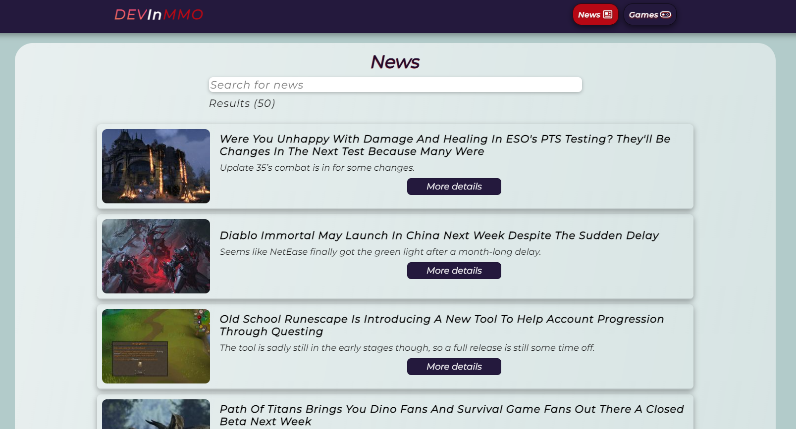

# Sobre o Projeto

- [Tecnologias Utilizadas](#tecnologias-utilizadas)
- [Instruções para rodar o projeto](#instruções-para-rodar-o-projeto)
- [Telas](#telas)

Segundo projeto avaliativo do primeiro módulo (FronEnd) do curso DEVInHouse. O Projeto consiste em uma aplicação simples, construída em React e consumindo a api [MMO Games API](https://rapidapi.com/digiwalls/api/mmo-games/) através do serviço [Rapid API](https://rapidapi.com/hub), com uma página listando as notícias, outra listando os games, e uma terceira com detalhes sobre o respectivo game selecionado na página anterior de listagem dos games. 
Na terceira página, sobre os detalhes do game selecionado,  deve constar um formulário com validação para envio de comentários, e os comentários devem contar com um  sistema de likes, ambos (comentários e likes) salvos no local storage e atrelados ao game em questão.

#### [Link do projeto na netlify](https://devinmmo-projeto2lms.netlify.app/)
# Tecnologias utilizadas:
* Javascript com **React**
* CSS-in-JS (Styled Components)
* HTML
* NodeJS
### ReactJS, Recursos utilizados:
##### Hooks
State, Effect, Context.
##### React Router ^6.0.2
UseParams, BrowserRouter, Routes, Route, Link, NavLink.
##### Axios ^0.24.0
Request(Get)
##### Formik ^2.2.9
Com Yup para validação.

# Telas

### News

---
### Games
---

### Games Details
---

---
### Responsividade

---
### 404

## Instruções para rodar o projeto.
É necessário se criar uma conta no site RapidAPI e subscrever-se no serviço: [MMO Games API](https://rapidapi.com/digiwalls/api/mmo-games/). Com a chave da api MMO-GAMES em mãos, é você precisa inseri-la em nas variaveis de ambiente, há um arquivo .env-example, com o modelo para inserção da chave. 
Basta clonar, ou fazer donwload deste repositório, e com o [Node](https://nodejs.org/en/) devidamente instalado, execute o comando(no terminal de sua preferência) "npm install -y" no diretório raiz deste projeto.
Após concluir a instalação, mantendo-se no diretório raiz do projeto, execute o comando "npm start".
Você também pode conferir o projeto rodando aqui [Link do projeto na netlify](https://devinmmo-projeto2lms.netlify.app/)
